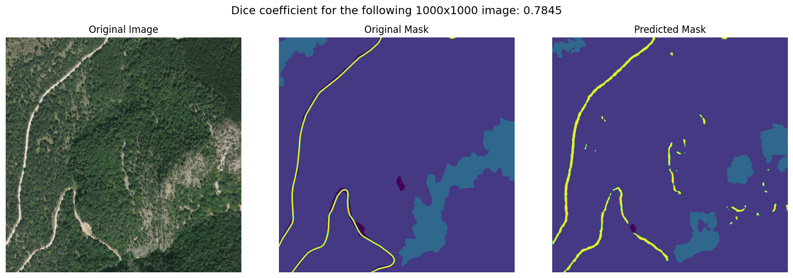

# Satellite Image Semantic Segmentation

This repository contains a deep learning project focused on performing semantic segmentation on satellite imagery (dataset from IGN). The project uses a neural network to classify each pixel in an image, labeling it as part of an object class such as buildings, roads, or vegetation. The whole project has been built using Tensorflow with Keras.

## Model Architecture
The project employs a **convolutional neural network (CNN)** designed for semantic segmentation. A commonly used architecture for this task is the **U-Net**.

Key components of the model:
- **Encoder**: A CNN (e.g., ResNet or VGG) that extracts high-level features from the input image inspired from Resnet.
- **Decoder**: A series of upsampling layers that restore the spatial resolution of the input while generating a pixel-wise prediction map.
- **Skip connections**

## Evaluation
After training, the model is evaluated on the test dataset using as metric the  **Dice coefficient**.

## Results
The notebook provides sample results, displaying segmented images with color-coded pixel predictions for each class.

Example:

